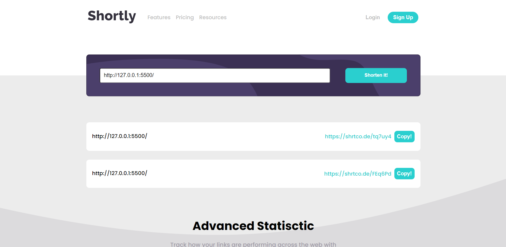
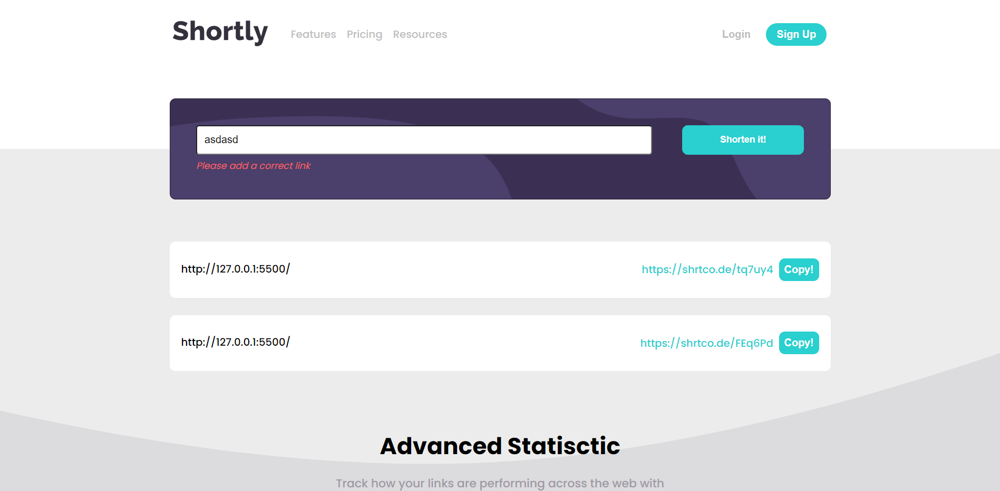
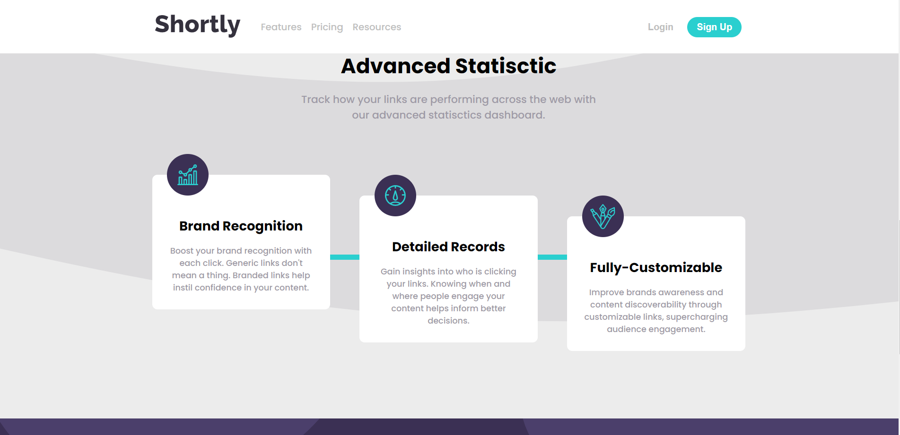
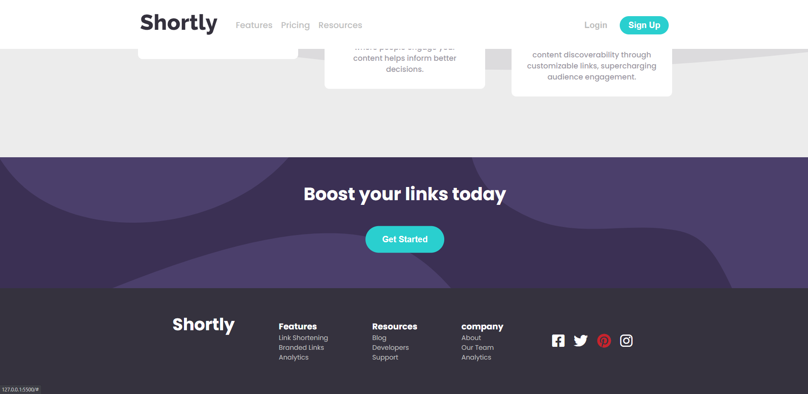
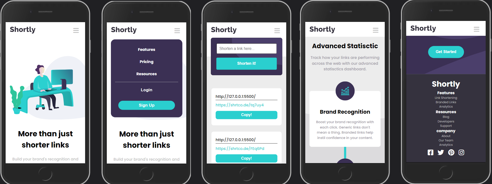
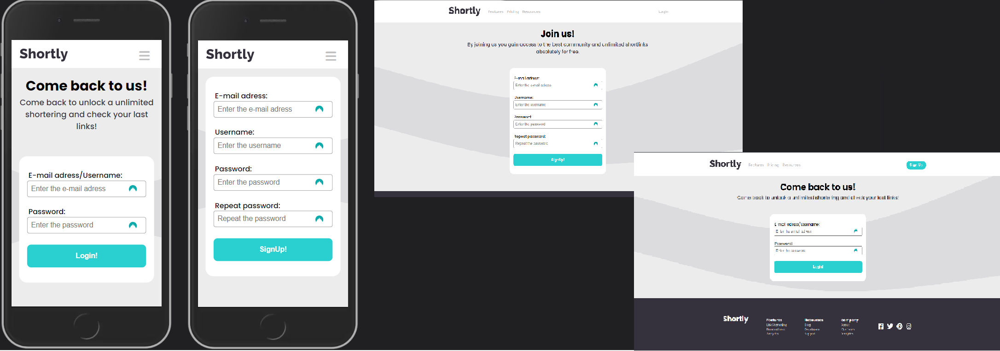

# Frontend Mentor - Shortly URL shortening API Challenge solution + Account functionality

## Links

- Live Site URL: [LIVE](https://danillakam.github.io/URL-Shortering/)

## Table of contents

- [Overview](#overview)
  - [The challenge](#the-challenge)
  - [Screenshot](#screenshot)
- [My process](#my-process)
  - [Built with](#built-with)
  - [What I learned](#what-i-learned)
  - [Continued development](#continued-development)
  - [Useful resources](#useful-resources)

## Overview

### The challenge

Users should be able to:

- View the optimal layout for the site depending on their device's screen size
- Shorten any valid URL
- See a list of their shortened links, even after refreshing the browser
- Copy the shortened link to their clipboard in a single click
- Receive an error message when the `form` is submitted if:
  - The `input` field is empty

### Screenshot









## My process

### Built with

- Semantic HTML5 markup
- CSS custom properties
- SCSS
- Flexbox
- Mobile-first workflow
- Vanilla JavaScript

### What I learned

## Export and Import elements.

```js
export const logout = () => {
	const users = JSON.parse(localStorage.getItem('allUsersJson')).users
	users.forEach(user => {
		user.status = 'false'
	})
	setStatusAddUsers('false', users)
	location.reload()
}
```

## Work with objects in local storage.

```js
const setDefaultUser = () => {
	if (localStorage.getItem('allUsersJson') == null) {
		localStorage.setItem('allUsersJson', `{ "users":[]}`)
		localStorage.setItem('Unlogged links', '{"links": []}')
	}
}
```

## Work with RegExp

```js
const regExpURl =
	/^https?:\/\/(?:www\.)?[-a-zA-Z0-9@:%._\+~#=]{1,256}\.[a-zA-Z0-9()]{1,6}\b(?:[-a-zA-Z0-9()@:%_\+.~#?&\/=]*)$/
```

### Continued development

In future i wanna create the same project with learn (learn in porgress ;) ) adn maybe build a backend to this.

### Useful resources

- [Font-Awesome](https://fontawesome.com/) - A lot usefull of icons.
- [MDN](https://developer.mozilla.org/en-US/) - Helpfull articles.
